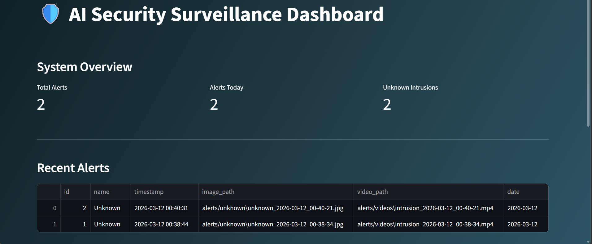

# 🛡️ AI Security Surveillance System

An **AI-powered security surveillance system** that detects intrusions, records evidence, and displays alerts through a monitoring dashboard.

The system automatically captures **images and short video clips when a person is detected**, logs the event into a database, and allows monitoring through an interactive **Streamlit dashboard**.

---

# 🚀 Features

* 🤖 AI-based person detection
* 🎥 Automatic video recording during intrusion events
* 📸 Image capture for visual evidence
* 🗃 Alert logging using SQLite database
* 📊 Interactive Streamlit monitoring dashboard
* 🔔 Real-time alert monitoring
* 👤 Known face recognition support

---

# 📷 Dashboard Preview

Below is the monitoring dashboard used to visualize security alerts and recorded evidence.

<p align="center">
  
</p>

The dashboard allows users to:

* View intrusion alerts in real time
* Browse alert history stored in the database
* View captured evidence images
* Watch recorded intrusion videos
* Monitor system statistics and activity

---

# 🧠 System Architecture

```
Camera / Video Feed
        │
        ▼
AI Detection System (OpenCV / Detection Model)
        │
        ▼
Event Trigger
        │
        ▼
Evidence Recording (Image + Video)
        │
        ▼
SQLite Database Logging
        │
        ▼
Streamlit Dashboard for Monitoring
```

---

# 📁 Project Structure

```
ai-security-surveillance-system

app.py                  # Streamlit dashboard
main.py                 # Detection and surveillance system
event_recorder.py       # Event-based video recording logic
requirements.txt        # Python dependencies
README.md
.gitignore

assets/
    dashboard.png       # Dashboard preview image

alerts/
    images/             # Captured evidence images
    videos/             # Recorded intrusion videos

known_faces/            # Authorized faces dataset
```

---

# ⚙️ Installation

### 1️⃣ Clone the repository

```
git clone https://github.com/YOUR_USERNAME/ai-security-surveillance-system.git
```

### 2️⃣ Navigate into the project folder

```
cd ai-security-surveillance-system
```

### 3️⃣ Create a virtual environment

```
python -m venv venv
```

### 4️⃣ Activate the environment

**Windows**

```
venv\Scripts\activate
```

**Mac / Linux**

```
source venv/bin/activate
```

### 5️⃣ Install dependencies

```
pip install -r requirements.txt
```

---

# ▶️ Running the Project

### Start the surveillance system

```
python main.py
```

### Run the monitoring dashboard

```
streamlit run app.py
```

The dashboard will display **recorded alerts including captured images and videos**.

---

# 📊 Dashboard Features

The Streamlit dashboard provides:

* 📈 System overview statistics
* 📜 Alert history
* 🖼 Image evidence viewer
* 🎥 Video playback for intrusion events
* ⏱ Real-time security monitoring

---

# 📦 Technologies Used

* Python
* OpenCV
* Streamlit
* SQLite
* NumPy
* Pandas

---

# 🎯 Use Cases

* Smart home surveillance systems
* Office security monitoring
* Intrusion detection solutions
* AI-powered CCTV monitoring

---

# ⚠️ Note

Large files such as **videos, images, datasets, and database files** are excluded from the repository using `.gitignore`.

---

# 👨‍💻 Author

Developed as part of a **Deep Learning / Computer Vision project** demonstrating an AI-based security monitoring system.
